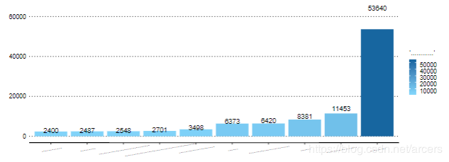
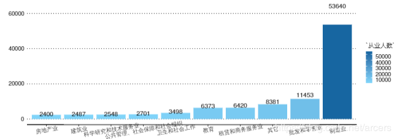
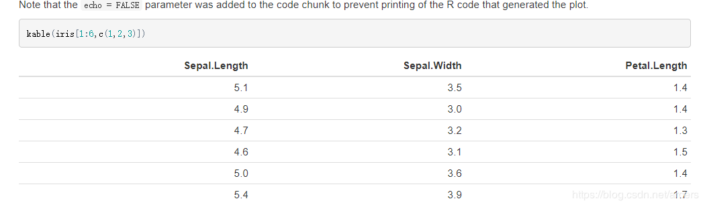
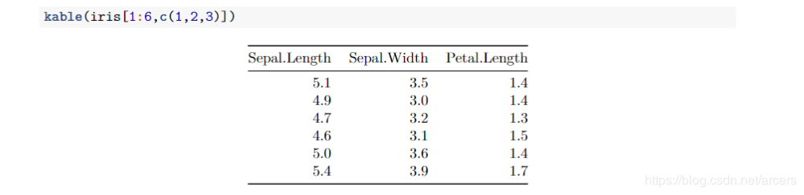
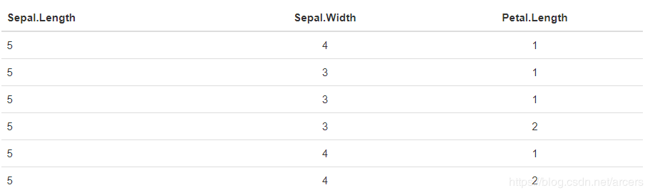
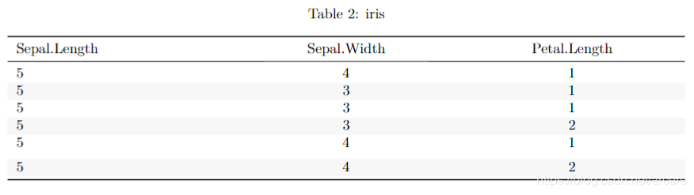
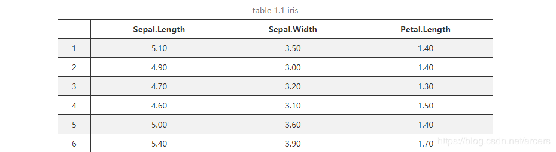

```{r setup, include=FALSE}
knitr::opts_chunk$set(echo = TRUE)
```

Rmarkdown是我笔者目前进行数据分析文档（分析报告、技术文档等）编写的主要途径，在应用
中最吸引人也是最强大的方面是可以将.rmd文件部署为自动化分析报告的模板文件。当然除
非对rmd的编写有较为丰富的经验，否则一定会遇到一些配置方面的问题，本文列举一些笔者
在实践中遇到的问题以供参考。

## 1.pandoc
Rmd文件在转化为pdf的过程中需要用到[pandoc](http://pandoc.org/)，而低版本的pandoc可能不支持生成pdf文件，因此需要确保，服务器或本地环境已安装了pandoc并且是相对高的版本。可以通过命令行直接调用pandoc将.md文件或.html文件转换为pdf。基本使用命令如下：

- **md转pdf**: `pandoc somefile.md -o somefile.pdf`, 指定编译器（包含中文）`pandoc --latex-engine=xelatex somefile.md -o somefile.pdf`。
- **html转pdf**: 同上。

当然这也提供了一个生成pdf的途径即：使用knitr生成html文件，再使用pandoc转换为pdf(实际上这和直接生成pdf没有本质区别)。
**Attentation**: 在命令行中使用pandoc转换由knitr生成的html文件为pdf时可能会报错如下：
```
Stack space overflow: current size 16777216 bytes.
Use `+RTS -Ksize -RTS' to increase it.
Error: pandoc document conversion failed with error 2
```

解决方法为在.rmd 文件的头部添加如下配置：
```
  html_document:
      pandoc_args: ["+RTS", "-K100000000", "-RTS"]
```
或者在命令行中写成这样：
```
pandoc RTS -K100000000 -RTS --latex-engine=xelatex somefile.html -o somefile.pdf
```
>参考链接：
https://stackoverflow.com/questions/25599860/how-to-increase-stack-space-overflow-for-pandoc-in-r
http://www.cnblogs.com/liuyangnuts/archive/2013/04/23/3038354.html 
https://superuser.com/questions/1073291/pandoc-has-stack-size-error/1073707
http://www.cnblogs.com/airbird/p/6160223.html


## 2.中文编码
中文编码的坑在任何时候都少不了，如果不加配置，直接在头文件中设置`output: pdf_document`，然后点击‘knit’那个毛线团的小按钮，或者命令行中调用如下命令:
```
R -e 'rmarkdown::render("some.rmd", output_format = "all", output_dir = "some.pdf")'
```
如果文件中使用了中文，那么应该会出现第一个编码问题，错误信息大概就像下面（标题中使用了“年”这个字），解决方式有两种。
```
! Package inputenc Error: Unicode char 年 (U+5E74)
(inputenc)                not set up for use with LaTeX.

See the inputenc package documentation for explanation.
Type  H <return>  for immediate help.
 ...   
```

### 2.1 使用中文模板
rticles包提供了适用于各类场景的rmd模板，安装以后便可以选择支持中文的模板，在rstudio菜单栏中依次选择file->new file->R Markdown，然后选择下图所示的模板。当然模板本身就包含了如何使用中文的说明。

### 2.2 引用tex配置文件
由于应用上需要同时生成html以及pdf，显然上述的模板并不能满足要求。此时可以通过在头文件中引用tex配置文件的方式解决问题：
```r
output:
  pdf_document:
      latex_engine: xelatex
      includes:
        in_header: head.tex
```
head.tex中的内容如下，不懂latex必须承认是网上抄的，第一句解决中文问题，第二句实现首行缩进。
```
\usepackage{ctex} 
\parindent 2em
```
>参考链接:
>https://www.jianshu.com/p/a97b4a9f6d5b


## 3.绘图乱码
文字解决了但是事儿没完，这是关于编码的第二个坑，就像下面这样，用ggplot2生成的图片中的中文字符全部变成了‘...’的形式。


怀疑过字体问题、tex设置问题、操作系统以及人生。。。最终通过仔细查阅官方文档以及stackoverflow最终发现图形设备需要额外指定，方式为在头文件中加入如下'dev'的配置，当然也可以设置为其它的图形设备。
```{r echo=TRUE, eval=FALSE}
output:
  pdf_document:
      latex_engine: xelatex
      dev: cairo_pdf
      includes:
        in_header: head.tex
```


其中图形设备可以替换为下列中的任何一个：bmp, postscript, pdf, png, svg, jpeg, pictex, tiff, win.metafile, cairo_pdf, cairo_ps, CairoJPEG, CairoPNG, CairoPS, CairoPDF, CairoSVG, CairoTIFF, Cairo_pdf, Cairo_png, Cairo_ps, Cairo_svg, tikz and a series of quartz devices including quartz_pdf, quartz_png, quartz_jpeg, quartz_tiff, quartz_gif, quartz_psd, quartz_bmp。
过这个坑花了不少时间，然而这并不是结束。当然图片乱码的问题除此之外也可以使用showtext解决。

>参考链接：
问题：https://github.com/yihui/knitr/issues/889 
文档：https://yihui.name/knitr/demo/graphics/
文档：https://yihui.name/knitr/options/#plots
https://blog.csdn.net/u012111465/article/details/79945372

## 4.图片错位
在转换为pdf的时候，有时候图片不会显示在放置它的位置，而是跑到了latex认为合适的位置。解决方式为设置参数`fig.pos='H'`，可以像下面那样设置为全局参数。
```
knitr::opts_chunk$set(fig.pos='H')
```
>参考链接
问题：https://stackoverflow.com/questions/29696172/how-to-hold-figure-position-with-figure-caption-in-pdf-output-of-knitr
问题：https://stackoverflow.com/questions/16626462/figure-position-in-markdown-when-converting-to-pdf-with-knitr-and-pandoc

## 5.表格样式
### 5.1 kable
在knitr的众多功能中，对[图片](https://yihui.name/knitr/options/?version=1.1.463&mode=server#plots)的支持是相当丰富的。但是对表格似乎就不这么友好了，除了kable函数外一个也没有。尤其是转换为pdf以后，表格的样式变化很大，同时通过css修饰的样式也完全不能保留。

html:




pdf:



一种解决方式是采用kableExtra对表格样式进行修饰，并且通过`knitr::is_html_output()`判断输出格式进行对应表格的绘制：
```{r echo=TRUE, eval=FALSE}
library(knitr)
library(kableExtra)
library(magrittr)
tb <- iris[1:6,c(1,2,3)]

if (is_html_output()) {
  kable(
  tb, format = "html", digits = 0, longtable = TRUE,
  booktabs = FALSE, align = c('l', 'c', 'c'),
  caption = 'table1.1 iris'
  )  %>% kable_styling(
    full_width = TRUE
  )
} else {
  kable(
  tb, format = "latex", digits = 0, longtable = TRUE, 
  # padding = 2, 
  booktabs = TRUE, align = c('l', 'c', 'c'),
  caption = 'iris' 
  ) %>% kable_styling(
    full_width = TRUE,
    latex_options = c("striped", "hold_position", "scale_down")
  ) 
}

```

html:



pdf:



### 5.2 xtable
xtable是另一种选择。
```{r results="asis", echo=TRUE, eval=FALSE}
library(xtable)
tb <- iris[1:6,c(1,2,3)]
print(
  xtable(tb, caption = 'table 1.1 iris'), type = 'html', 
  caption.placement = 'top'
  ) 
```



>参考链接
>https://stackoverflow.com/questions/15258233/using-table-caption-on-r-markdown-file-using-knitr-to-use-in-pandoc-to-convert-t
>https://stackoverflow.com/questions/21397407/knitr-r-markdown-and-xtable-xtable-tables-within-html-table

## 6.参考资料
>其它参考资料

>[how-to-convert-r-markdown-to-pdf](https://stackoverflow.com/questions/11025123/how-to-convert-r-markdown-to-pdf)

>[how-to-convert-html-to-pdf-using-pandoc](https://stackoverflow.com/questions/44177555/how-to-convert-html-to-pdf-using-pandoc)

>http://www.bagualu.net/wordpress/archives/6182
